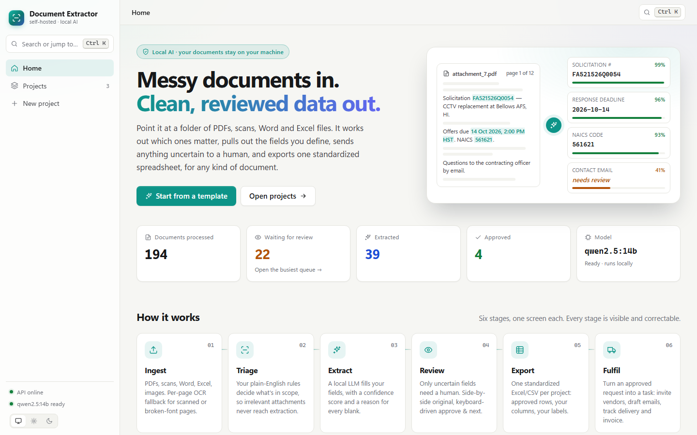
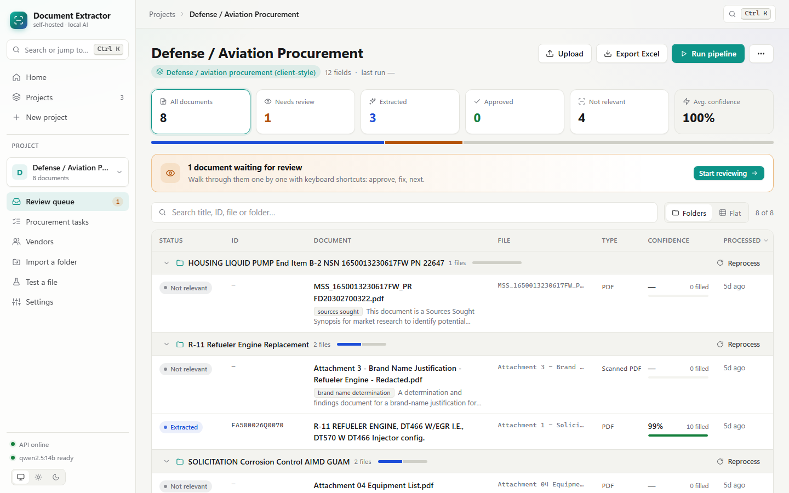
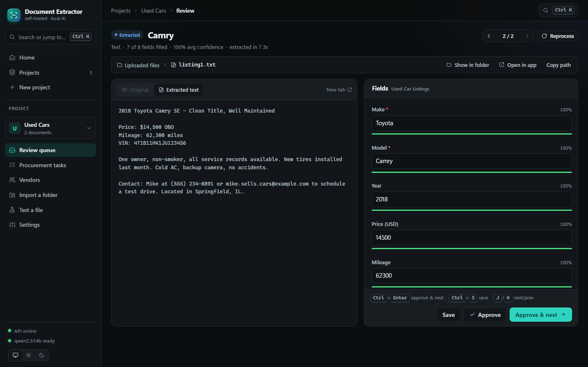
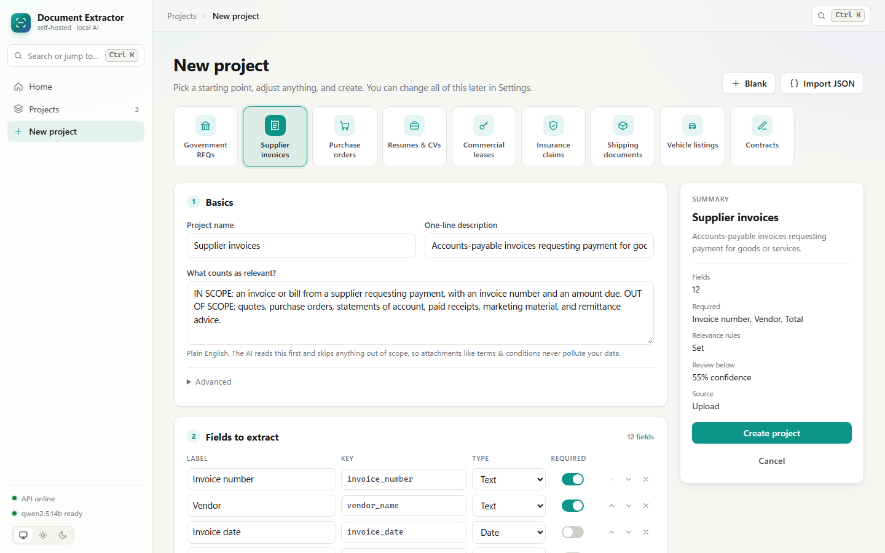
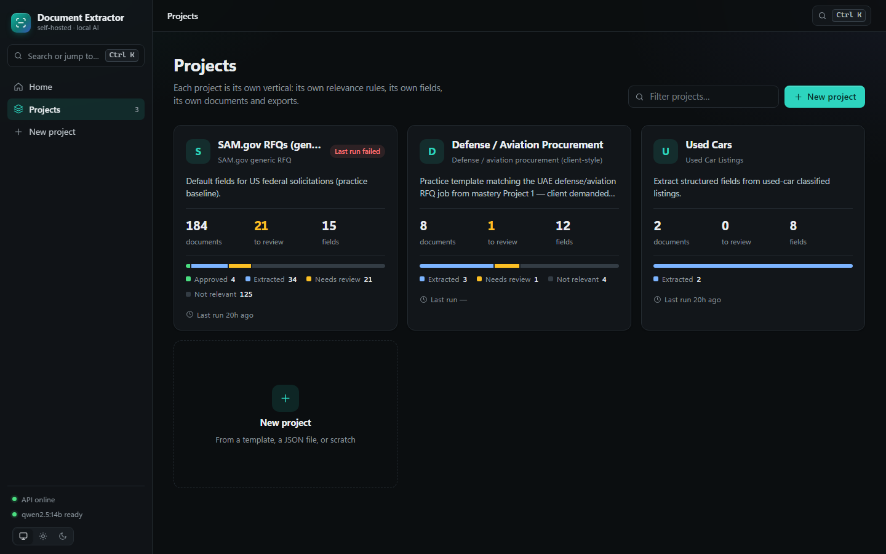
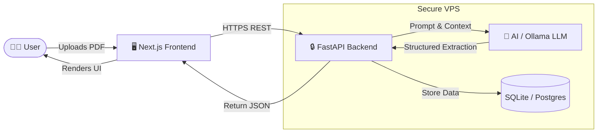

# 📄 Document Extractor - Showcase

> 🔒 **Architecture Note (Portfolio Strategy):** 
> To protect the core intellectual property, this repository acts as a **100% Hollow Showcase** (Documentation only). The entire application—FastAPI, Python extraction logic, Next.js frontend, and prompt engineering—is maintained securely in a private repository and deployed to a dedicated VPS.

---

**Messy documents in. Clean, reviewed data out.**

A self-hosted pipeline that turns piles of PDFs, scans, Word and Excel files into structured, human-verified rows, using a local LLM, so documents never leave your machine. Describe a document type in plain English, list the fields you want, and it does the rest: works out which files are relevant, extracts every field with a confidence score, sends only the uncertain ones to a person, and exports one standardized spreadsheet.

## 🚀 Highlights

- **Private by default.** Extraction runs on [Ollama](https://ollama.com) on your own hardware. No API keys, no per-page fees, no data leaving the building.
- **One app, many document types.** Each *project* is its own vertical with its own relevance rules, fields and sources. Start from one of nine ready-made templates or build your own, no code involved.
- **Confidence you can act on.** Every field comes with a confidence score, and every blank comes with a reason. Low-confidence fields are highlighted; everything else can be approved in one keystroke.
- **Built for messy inputs.** Scanned pages inside digital PDFs, broken PDF fonts that decode to garbage, Word forms with checkbox content controls, spreadsheets. See [`docs/`](docs/) for how each case is handled.
- **See where every value came from.** Click any field and the original jumps to its source, highlighted on the page (including OCR'd scans) or in the Word/Excel preview. Click a highlight to jump back to its field. The model quotes the exact passage it used for each value, so reformatted dates and short values like a quantity of "1" are still pinned to the right spot.
- **Keyboard-first review.** The original document sits next to its extracted fields. PDFs, scans, Word, Excel and text files are rendered by the app itself, so there's no plugin or download step. `Ctrl+Enter` approves and jumps to the next one.
- **Relevance triage.** A solicitation arrives with eight attachments; only two matter. Plain-English scope rules keep wage tables and boilerplate out of your data.
- **Portable templates.** Export any project's template as JSON and import it on another install, or share it with a client.
- **Beyond extraction.** An approved request can become a procurement task: invite vendors, have the LLM draft quote requests from the extracted fields, compare quotes, and track delivery through to invoice.

| Review queue | Side-by-side review |
|---|---|
|  |  |
| **New project from a template** | **Projects** |
|  |  |

## 🏗️ System Architecture

## 👥 Who it's for

Starter templates ship for these document types. Each one is a normal, fully editable template.

| Template | Extracts | Typical users |
|---|---|---|
| Government RFQs | Solicitation #, agency, deadline, NAICS, set-aside, part numbers | Gov contractors, bid teams |
| Supplier invoices | Invoice #, vendor, dates, subtotal, tax, total, line items | Finance & AP |
| Purchase orders | PO #, buyer, ship-to, delivery date, line items | Sales ops, order desks |
| Resumes & CVs | Name, contact, title, experience, skills, employers | Recruiters, staffing agencies |
| Commercial leases | Parties, premises, term, rent, deposit, renewal | Property managers |
| Insurance claims | Policy, claimant, incident date, type, estimated loss | Claims teams |
| Shipping documents | B/L #, shipper, consignee, ports, containers, weight | Freight forwarders |
| Vehicle listings | Make, model, year, price, mileage, VIN | Dealers, marketplaces |
| Contracts | Parties, effective date, term, renewal, governing law | Legal ops, procurement |

---
*Created as part of a professional portfolio showcasing full-stack product development.*
