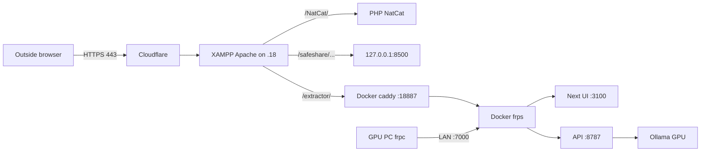

# Remote access to the GPU through a relay

How to use document-extractor from outside the office network, when its only GPU sits on a Windows PC that nothing outside can connect to.

**Status:** deployed on sacred-dev. Full app at `/extractor/`. **LLM-only inference** at `/llm/` (Ollama). See also easy guide: [`deploy/gpu-relay/README.md`](../deploy/gpu-relay/README.md).

**Easy-language ops guide (what the three Windows services do, how traffic flows):**  
[`deploy/gpu-relay/README.md`](../deploy/gpu-relay/README.md)

**Stop / pause / fully remove the relay (free resources):**  
[`deploy/gpu-relay/TEARDOWN.md`](../deploy/gpu-relay/TEARDOWN.md)

---

## 1. The situation

| Machine | What runs there | Network |
|---|---|---|
| **GPU PC** (`SACRED-IBRAHIM`, `172.22.1.140`) | document-extractor: relay UI `:3100`, API `:8787`, Ollama `:11434`, `frpc` | Can connect **out** to sacred-dev. Nothing outside can connect **in**. |
| **sacred-dev** (`172.22.1.18`, `riskcalculator`) | XAMPP Apache on **80/443** (NatCat + other sites), Docker (`gpu-relay`: frps + caddy), staging containers | Reachable from the internet via Cloudflare on 80/443 only. Cannot reach the GPU PC. |
| **sacred-prod** (`172.22.1.19`) | Production | **Not used** for this relay. |

Outside users can reach sacred-dev on **80 and 443 only**. Because the servers can't connect to the PC, **the PC opens a reverse tunnel**, and outside requests come back over that connection.

Live public hostname: **[https://natcat.sgs-suparco.gov.pk/](https://natcat.sgs-suparco.gov.pk/)** (Cloudflare → `.18`). Extractor path: **`/extractor/`**.

---

## 2. Architecture: reverse tunnel + existing Apache edge



### On sacred-dev: Docker compose `D:\deploy\gpu-relay`

| Container | Job | Exposure |
|---|---|---|
| `frps` | Accepts the PC's tunnel; remote ports `13100` (UI) and `18787` (API) stay on the Docker network | Control port **`172.22.1.18:7000`** (LAN only) |
| `caddy` | Basic auth, `/extractor/api/*` → API tunnel, `/extractor*` → UI tunnel, blocks PC-local endpoints, long timeouts | **`127.0.0.1:18887`** only |

### On sacred-dev: Apache (NatCat `:443` vhost)

Same pattern as SafeShare: `ProxyPass /extractor/` → `http://127.0.0.1:18887/extractor/` with `ProxyTimeout 700`. TLS stays on Apache + Cloudflare. Other sites (`/NatCat/`, `/safeshare/`, `*.local` vhosts) are untouched.

### On the GPU PC: three processes (prefer NSSM services)

| Process | Notes |
|---|---|
| `frpc` | Tunnel to `172.22.1.18:7000` with shared token |
| API | `uvicorn api:app --app-dir src --host 127.0.0.1 --port 8787` |
| Web UI | `next start -p 3100` with `basePath=/extractor`, `NEXT_DIST_DIR=.next-relay` |

If admin elevation is available, run `deploy/gpu-relay/bin/INSTALL-SERVICES-AS-ADMIN.bat`. Otherwise a **user logon** scheduled task `gpu-relay-autostart` runs `frpc/start-all-user.bat`.

**Operational notes**

- **No sleep.** A sleeping PC drops the tunnel.
- **Long requests.** Proxies use ≥ 700 s timeouts. Cloudflare may still cut very long single requests (~100 s on some plans); use background pipeline runs or a later job inbox if that becomes a problem.
- **Ollama stays private.** Never tunneled.

---

## 3. App changes for path hosting

The browser must not call `http://127.0.0.1:8787` from outside. For the NatCat path deploy:

- `NEXT_BASE_PATH=/extractor`
- `NEXT_PUBLIC_API_BASE=/extractor` → `u()` builds `/extractor/api/...`
- `NEXT_DIST_DIR=.next-relay` so the relay production build does not fight `next dev` (`.next`)

Configured in [`web/next.config.ts`](../web/next.config.ts). Build:

```bat
cd web
set NEXT_BASE_PATH=/extractor
set NEXT_PUBLIC_API_BASE=/extractor
set NEXT_DIST_DIR=.next-relay
npm run build
```

Start: `deploy/gpu-relay/frpc/start-web-relay.bat` (port 3100).

---

## 4. Security

- **Login at Caddy.** HTTP basic auth (bcrypt). Credentials live in `D:\deploy\gpu-relay\CREDENTIALS.txt` on sacred-dev and `deploy/gpu-relay/CREDENTIALS.txt` on the GPU PC (gitignored).
- **HTTPS.** Cloudflare + Apache origin TLS. Caddy is HTTP on localhost only.
- **frp control port LAN-only** (`172.22.1.18:7000`). Token auth.
- **Blocked at Caddy** (403):

| Endpoint | Why |
|---|---|
| `POST .../import-folder` | Arbitrary folder read on the PC |
| `POST .../documents/{id}/open-file` | Opens a file on the PC desktop |
| `POST .../documents/{id}/open-folder` | Opens Explorer on the PC |

---

## 5. Tradeoffs and alternatives

**Main tradeoff:** when the GPU PC is off or asleep, `/extractor/` is down (502 behind auth).

| Alternative | Notes |
|---|---|
| Job inbox (PC polls) | Later add-on for “submit while PC is off”; API-only |
| LLM-as-service (`/llm/`) | **Deployed** — Ollama via frp remote port `11435`, Apache → Caddy `:18888` |
| sacred-prod / new public port | Rejected: keep off prod; outside can only use 80/443 |
| Dedicated subdomain | Cleaner for Next `basePath`, but needs a new DNS record; path reuse of NatCat DNS was chosen |

---

## 6. Deployment record

| Item | Value |
|---|---|
| App URL | `https://natcat.sgs-suparco.gov.pk/extractor/` |
| LLM URL | `https://natcat.sgs-suparco.gov.pk/llm/` (OpenAI-compat: `/llm/v1/...`) |
| sacred-dev path | `D:\deploy\gpu-relay` |
| Compose | `docker compose --env-file .env up -d` (set `DOCKER_CONFIG` if SSH session hits wincred errors) |
| Caddy ports | `127.0.0.1:18887` (app), `127.0.0.1:18888` (LLM) |
| frp remotes | `13100` UI, `18787` API, `11435` Ollama |
| Apache backups | `httpd-vhosts.conf.bak-20261001-pre-extractor`, `...-pre-llm` |
| GPU PC services | `gpu-relay-api`, `gpu-relay-web`, `gpu-relay-frpc` (Automatic) |
| GPU PC binaries | `deploy/gpu-relay/bin\frpc.exe`, `nssm.exe` |

**LLM checks (done)**

1. `/llm/api/tags` lists `qwen2.5:14b` via Cloudflare + Basic auth  
2. `/llm/v1/chat/completions` returns a completion  
3. `/llm/api/pull` → **403**; no auth → **401**  
4. `/extractor/` still healthy  

**One admin step still needed on the GPU PC:** run `deploy\gpu-relay\bin\RESTART-FRPC-AS-ADMIN.bat` so the Windows `gpu-relay-frpc` service loads the `ollama-llm` proxy from `frpc.toml` (until then a temporary frpc process may be providing Ollama).

**Remaining ops**

- Ensure **Ollama starts at boot** (currently a user process: `ollama.exe serve`). Install/enable the Ollama Windows service or a Startup shortcut if reboot loses the model.  
- Cloudflare may time out very long generations (~100s); use streaming or shorter prompts, or a job queue later.  
- Do not sleep the GPU PC while the relay is needed.
