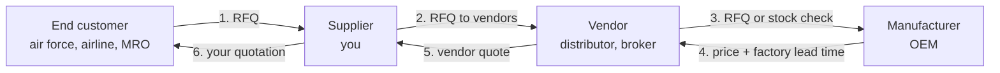
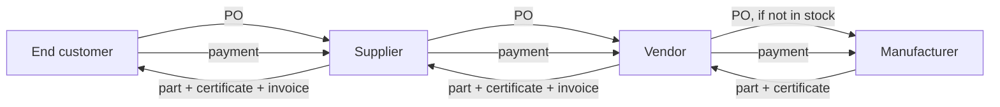
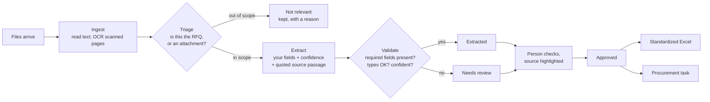

# From RFQ to financial closure: how the work really flows, and where this system fits

This guide explains the job this project was built for, how the work runs
inside a real company, what this system automates today, what a person still
does, and how to demo and pitch it. Read it top to bottom once, then keep
section 5 open while you click through the app.

New to the trade? Read section 1 here first, then do the story-based
exercise in **[Your first RFQ, step by step](USE_CASE_YOUR_FIRST_RFQ.md)**,
which walks you through one order as the supplier and teaches the words
people use at each step.

**Contents**

1. [The job that started this](#1-the-job-that-started-this)
2. [How an RFQ turns into money, in a real company](#2-how-an-rfq-turns-into-money-in-a-real-company)
3. [What this system does at each step](#3-what-this-system-does-at-each-step)
4. [Who does what: person vs. automation](#4-who-does-what-person-vs-automation)
5. [Hands-on walkthrough: one RFQ from inbox to closed](#5-hands-on-walkthrough-one-rfq-from-inbox-to-closed)
6. [Finding your way around the app](#6-finding-your-way-around-the-app)
7. [What's next: the gaps between this and the full job](#7-whats-next-the-gaps-between-this-and-the-full-job)
8. [Pitching it](#8-pitching-it)
9. [Glossary](#9-glossary)

---

## 1. The job that started this

The anchor job (from `mastery/01-document-extractor.md`) came from a defense and
aviation supply company in the UAE:

> "This is not a chatbot project. The objective is to build an operational AI
> system that manages the complete workflow from receiving an RFQ or tender
> until project delivery and financial closure."
>
> "Monitor designated folders and/or email for new RFQs. Read PDF, Excel, Word
> and scanned documents. Perform OCR on scanned files. Extract: RFQ Number,
> Platform / Aircraft, Part Numbers, Description, Quantity, UOM, Condition,
> Deadlines, Technical Notes... Generate standardized Excel files. Create
> procurement tasks. Track RFQ status."

Read it as a list of verbs: **watch, read, extract, standardize, create tasks,
track**. Only "extract" needs AI. Everything else is ordinary engineering:
folders, files, status, spreadsheets. That's why the pitch is "an operations
system with AI inside", never "an AI chatbot".

### Who this company is

A company like this is usually a **supplier** (also called a *trader*,
*reseller* or *stockist*; people in the trade also say *middleman*). It
doesn't make aircraft parts. It wins orders from customers (air forces,
airlines, maintenance shops) and buys the parts from someone further up the
chain. It earns the **margin** between the price it pays and the price it
charges.

### The supply chain: the same work, repeated at every level

A part usually passes through three or four companies between the factory and
the hangar that fits it:

| Level | Who | Example | What they do |
|---|---|---|---|
| **End customer** | The organisation that needs and uses the part | an air force, an airline, an **MRO** (maintenance shop) | Sends the RFQ and pays for everything in the end |
| **Supplier** (you) | The company this system is for | a UAE aviation-parts trader | Finds the part, quotes the customer, handles paperwork and delivery |
| **Vendor** | Whoever the supplier buys from | an **authorized distributor**, a **broker**, a stockist | Holds stock, or orders it from the factory |
| **Manufacturer** | The company that makes the part | the **OEM** (original equipment manufacturer) | Makes the part and sets the list price |

Each level does **the same RFQ work** you see in this guide, one level up:

1. The customer sends **you** an RFQ.
2. You send your own RFQ to several **vendors**. (You don't forward the
   customer's document; see "Why you hide the customer" below.)
3. A vendor that has the part in stock quotes straight away. One that doesn't
   asks the **manufacturer** for a price and a factory lead time.
4. Each answer goes back down the chain, and each level **adds its own margin
   and its own lead time**.

When the customer says yes, the chain runs again in the other direction:
purchase orders go up, parts and paperwork come down, invoices and payments
follow.

Two different quotes are in play, and people mix them up:

- the **vendor quote**: what it costs *you* to buy the part;
- **your quotation** to the customer: what *you* charge, which is cost +
  freight + other costs + margin.

### Who gets what: an example price stack

One hydraulic pump. The customer pays **25,000**. That single payment is
split up the chain like this (all figures are made-up but realistic
proportions):

| Step | Amount | Who keeps it |
|---|---:|---|
| Manufacturer's price to the distributor | 18,000 | Manufacturer: cost of making it + its profit |
| Distributor's price to you | 21,000 | Distributor keeps 3,000 |
| Freight, insurance, bank charges, customs handling | 1,000 | Freight forwarder, bank, customs |
| **Your landed cost** (everything you paid to get the part to you) | **22,000** | |
| Your price to the customer | 25,000 | **You keep 3,000** |

So yes: the end customer pays for **everyone**: the manufacturer, the
vendor, the freight, and you. Every level in the chain adds its cut.

### Margin, markup and commission: three different words

You'll hear all three. They are not the same thing.

| Word | Meaning | In the example |
|---|---|---|
| **Margin** | Your profit as a percentage of **your selling price** | 3,000 ÷ 25,000 = **12% margin** |
| **Markup** | Your profit as a percentage of **your cost** | 3,000 ÷ 22,000 = **13.6% markup** |
| **Commission** | A fee paid to an **agent** who connects buyer and seller but never buys the goods | not used here |

- **You earn margin, not commission.** You buy the part with your own money,
  own it, carry the risk if it's faulty or late, and resell it. That's a
  *trader* or *principal*.
- **An agent earns commission.** An agent (or *representative*) introduces a
  buyer to a manufacturer, never owns the goods, and the manufacturer pays
  them a percentage (say 3–5%) of the sale. Some foreign manufacturers work
  through a local agent in the Gulf. It's a different business model from
  trading.
- **Margin and markup are not the same number.** "Put 12% on it" is ambiguous,
  so ask whether they mean margin or markup. The formula to hit a *margin*
  is `price = cost ÷ (1 − margin)`: 22,000 ÷ 0.88 = 25,000. The common
  mistake is `cost × 1.12` = 24,640, which is a 12% *markup* and only a 10.7%
  margin.

### Why doesn't the customer just buy from the vendor or the manufacturer?

It's a fair question, and customers ask it too. Sometimes they do buy direct.
Usually they don't, because the supplier's margin pays for work and risk the
customer would otherwise have to take on:

| Reason | What it means in practice |
|---|---|
| **The manufacturer won't sell to them** | Many OEMs sell only through **authorized distributors**, or only in large quantities (a **minimum order quantity, MOQ**). An MRO needing 2 pumps is too small to deal with the factory directly. |
| **Approved vendor lists** | Air forces and airlines can only buy from companies on their **approved vendor list (AVL)**. Getting on it takes audits, registration and paperwork. They register a few trusted suppliers rather than hundreds of foreign vendors. |
| **One supplier, hundreds of parts** | One RFQ may list 40 parts from 25 different manufacturers. The customer places one order with you; you deal with 25 vendors. |
| **Finding the part at all** | For old aircraft, parts are often out of production (**obsolete**). Finding one in serviceable condition, anywhere in the world, with valid papers, is specialist work. |
| **Paying before, being paid after** | Brokers often want payment **in advance**. Government customers typically pay **30–90 days after invoice**. You finance the gap from your own cash. |
| **Paperwork and compliance** | Release certificates (FAA 8130-3, EASA Form 1), traceability, **export licences** (e.g. US ITAR/EAR items), **end-user certificates**, customs. A mistake stops the part at the border or grounds the aircraft. |
| **Risk and warranty** | If the part is fake, faulty or late, the customer's contract is with you. You carry the claim, the replacement and the return. |
| **Local presence** | Local language, currency, working hours and legal entity. In the Gulf, programmes such as the UAE's **In-Country Value (ICV)** scoring can favour local companies in tenders. |

**When customers do buy direct:** large, regular volumes (an airline's
long-term contract with an OEM), or a simple catalogue part with no paperwork.
That's why a supplier's value is in the **hard, small, urgent and
paperwork-heavy orders**, and why speed matters: often the first compliant
quote wins.

**Why you hide the customer.** If a vendor learns who your customer is, the
vendor can quote them directly and cut you out. So suppliers:

- send vendors their **own** RFQ with their **own reference number**, never
  the customer's document;
- leave out the customer's name, email and RFQ number;
- give only what the vendor needs to quote: part number, quantity,
  condition, certificates, delivery place.

This system does the same: the AI-drafted vendor email uses the task's
reference (e.g. *RFQ-T0003*) and leaves out the customer's name, contact
details and RFQ number.

### Why we practiced on SAM.gov

The client's real RFQs are private. **SAM.gov** is the US government's public
procurement site, and its RFQs are the same kind of document: solicitation
numbers, part numbers, quantities, deadlines, contracting offices, scanned
forms, attachments. So the `sam-rfq-default` and `defense-aviation` projects
use public SAM.gov data as a stand-in. The `defense-aviation` template's fields
are exactly the ones the client listed: RFQ number, platform/aircraft, part
numbers, description, quantity, UOM, condition, deadline, technical notes.

---

## 2. How an RFQ turns into money, in a real company

Here is the full life of one RFQ at a supplier company. The **owner** column
is the role that usually does it; in a small company one person may wear
several hats.

| # | Step | What happens | Owner |
|---|---|---|---|
| 1 | **Receive** | RFQs arrive by email, customer portals and tender sites, often as a PDF plus attachments (specs, drawings, terms). Some are scans. | Sales / bid desk |
| 2 | **Read & log** | Someone opens every file, works out which one is the actual request, and retypes the key facts into a spreadsheet or ERP. | Sales / bid desk |
| 3 | **Bid / no-bid** | Can we source this part? Is the deadline realistic? Is there export control? Is it worth it? | Bid manager |
| 4 | **Source** | Send RFQs to 3–10 vendors asking for price, lead time, condition and certificates. | Procurement officer |
| 5 | **Compare quotes** | Vendor replies arrive over days, in different formats. Put them side by side and pick the best on price, lead time, condition and trust. | Procurement officer |
| 6 | **Quote the customer** | Cost + freight + duties + margin = our price. Send a formal quotation before the deadline. | Bid manager |
| 7 | **Win / lose** | The customer awards a purchase order (PO), or doesn't. | Sales |
| 8 | **Order** | Place a PO with the chosen vendor and get an order confirmation. | Procurement |
| 9 | **Ship & track** | Vendor ships. Freight forwarder, customs, export licences if needed. Inspect on arrival, check certificates. | Logistics |
| 10 | **Deliver** | Deliver to the customer and get a signed delivery note. | Logistics |
| 11 | **Invoice & get paid** | Invoice the customer, collect payment, pay the vendor. | Finance |
| 12 | **Close** | Record the actual margin, archive the file, close the job. | Finance |

**Where the time goes.** Steps 2 and 5 are pure retyping and cross-checking,
and they happen on *every* RFQ, including the ones the company doesn't bid on.
That is what this system automates first.

**Where the risk is.** One wrong digit in a part number or quantity at step 2
travels all the way to step 11. That's why this system never silently accepts
a value it's unsure of, and why it shows where every value came from.

---

## 3. What this system does at each step

Legend: ✅ built and working · 🟡 built as a working mock (manual inputs, nothing sent) · ❌ not built yet

| # | Step | In this system | Where in the app |
|---|---|---|---|
| 1 | Receive | ✅ Watched folder, upload (drag & drop), SAM.gov API. ❌ Email inbox monitoring. | **Run pipeline**, **Import a folder**, drop files on the queue |
| 2 | Read & log | ✅ Reads PDF, scanned PDF (OCR), Word, Excel, images and text. ✅ Decides which files are relevant. ✅ Extracts your fields, each with a confidence score and the passage it came from. | Queue → review screen |
| 2b | Check | ✅ A person reviews only what's uncertain, with the source highlighted on the page. | Review screen: **Approve & next** |
| 2c | Standardize | ✅ One Excel/CSV per project: approved rows, your columns. | **Export Excel** |
| 3 | Bid / no-bid | ❌ A person decides; the system doesn't record the decision yet. | — |
| 4 | Source | 🟡 Vendor directory; invite vendors to a task; the AI drafts each RFQ email from the extracted fields (drafts only, never sent). | **Vendors**, task page |
| 5 | Compare quotes | 🟡 Type in each vendor's price, lead time and notes; select the winner. | Task page → Quotes |
| 6 | Quote the customer | ❌ No margin calculation or customer quotation yet. | — |
| 7 | Win / lose | ❌ Not tracked. | — |
| 8–10 | Order, ship, deliver | 🟡 Stage tracking: Ordered → Shipped → Delivered, with a timeline. | Task page stepper |
| 11–12 | Invoice & close | 🟡 Invoice amount + note, then Closed. | Task page → Financial closure |
| — | Track RFQ status | ✅ Every document has a status (Needs review, Extracted, Approved, Not relevant) and every task a stage, with an event timeline. | Queue tiles, **Procurement tasks** |

### The document pipeline, in detail

What each stage protects you from:

- **Ingest.** Scanned pages inside digital PDFs, fonts that decode to garbage,
  and Word forms with checkboxes are all handled, instead of silently
  producing empty or wrong text.
- **Triage.** A SAM.gov notice comes with a solicitation plus wage
  determinations, clause lists, maps and pricing sheets. In the
  `sam-rfq-default` project, **221 of 316 documents (70%)** were set aside as
  not relevant, each with a one-line reason, so nobody reviews them.
- **Extract.** The model must answer "not in the document" with a reason
  rather than guess. It also quotes the exact passage it used for each value.
  Its output is forced to contain every field, so it can't answer the first
  few and stop. Each field has a one-line meaning (Settings → Fields to
  extract, the line under each field), such as "a Product Service Code is
  not a part number". A small local model gets much of its accuracy from
  these lines, so write them the way you'd brief a new colleague.
- **Skipped fields.** If the model still skips a field, the document goes to
  **Needs review**, gets an "N skipped" tag, and the queue offers
  **Re-check**. Re-check re-runs only those documents and never touches one a
  person corrected or approved.
- **Validate.** A missing required field, a malformed email or a
  low-confidence value sends the document to **Needs review** instead of
  straight into your spreadsheet.
- **Review.** Click any field to jump to its source on the page. Most
  documents take one keystroke (`Ctrl+Enter`) to approve.

---

## 4. Who does what: person vs. automation

The goal is not "no people". It's **people only where judgment is needed**.

| Task | Before | With this system | Person still needed? |
|---|---|---|---|
| Open every file in every notice | Person, every file | Automatic | No |
| Decide which file is the actual RFQ | Person | Automatic (triage), with a reason for each rejected file | Only to spot-check the "Not relevant" list |
| Retype RFQ number, part numbers, quantity, deadline… | Person, every RFQ | Automatic | No |
| Check the typed values against the document | Person, often skipped | Only uncertain fields are flagged, each with its source highlighted | **Yes**: review and approve (seconds per document) |
| Build the tracking spreadsheet | Person | Automatic from approved rows | No |
| Bid / no-bid | Person | Person | **Yes**: a commercial decision |
| Write RFQ emails to vendors | Person, one per vendor | AI drafts each from the extracted fields | **Yes**: read, adjust, send |
| Record vendor quotes | Person | Person (typed in) | Yes, until email reading is added |
| Pick the vendor | Person | Person, with quotes side by side | **Yes**: a commercial decision |
| Track order → delivery → invoice | Person, in email and spreadsheets | One task page with a stage stepper and timeline | Yes: updates each stage |

**The honest one-liner:** the system removes the retyping and the searching,
keeps a person on every decision, and makes every number traceable to where
it came from.

---

## 5. Hands-on walkthrough: one RFQ from inbox to closed

You'll take one real public RFQ through the whole flow. Start the app (see
the README), then open **http://localhost:3000**. Vendor names and prices
below are **made up for the exercise**; everything about the RFQ itself comes
from the real document.

**The RFQ:** solicitation **FA500026Q0070**, *R-11 refueler engine* (DT466
W/EGR, DT570 with DT466 injector config), issued by the US Air Force's 673d
Logistics Readiness Squadron at JBER, Alaska. Quantity **1 each**, offers due
**24 Sep 2026**. It lives in the **Defense / Aviation Procurement** project,
folder *R-11 Refueler Engine Replacement*.

### Step 1: Receive (intake)

- In a real deployment, a **watched folder** (Settings → Document sources) or
  the **SAM.gov source** pulls new notices in when you press **Run pipeline**.
- For a one-off, drag files onto the project page, or use **⋯ → Import a
  folder…**
- To try a file *without* saving anything, use **Test a file**. It runs the
  whole pipeline and shows the result.

> **Real world:** this replaces "someone downloads the notice and saves the
> attachments somewhere".

### Step 2: Triage (which file is the RFQ?)

Open **Defense / Aviation Procurement**. The tiles show counts per status; the
table groups files by folder. In the *R-11 Refueler Engine Replacement*
folder, the solicitation is **Extracted**.

For a clearer triage example, open **SAM.gov RFQs (generic)** and click the
*BAFS CCTV Replacement* folder name. Of its 7 files, the wage determination
(`attachment_1.pdf`), the base-access guidance (`attachment_4.pdf`) and the
clauses-by-reference list (`attachment_5.pdf`) are **Not relevant**, each with
a one-line reason under its name. The solicitation itself was extracted.

> **Real world:** this is the "which of these eight attachments do I actually
> need to read?" step, done automatically, with the reasoning written down.

### Step 3: Review with sources

Click the solicitation. On the review screen:

1. The **Original** tab shows the real PDF pages. Yellow boxes mark where each
   field was found.
2. Click the **Deadline** field. The page jumps to block 8 of the form, "24
   Sep 2026", outlined and labelled. The field shows **Source · page 1**.
3. Click **Quantity**. It jumps to the line item on page 3, "0001 **1** Each".
   The model quoted that row, so even a value as ambiguous as "1" is pinned
   to the right spot.
4. Click a yellow box on the page. The matching field is selected on the
   right.
5. Chips next to fields tell you how each was found: **p.3** means found on
   page 3; **14× in doc** means the value is too common to pin down; **not
   located** means it isn't in the text word-for-word.

If anything is wrong, fix it in the field and press **Ctrl+S**. When it's
right, press **Ctrl+Enter** (Approve & next).

> **Real world:** this is the "check the typed values against the document"
> step people often skip. Here it takes seconds, because you only look where
> the system points you.

### Step 4: Standardized Excel

Back on the project page, **Export Excel** downloads the approved rows with
your field names as columns, ready for the ERP or the bid tracker.

### Step 5: Create the procurement task

On the approved document, click **Create procurement task**. The task page
opens with a stepper: **Sourcing → Ordered → Shipped → Delivered → Invoiced →
Closed**, and the RFQ's extracted details at the top.

> **Real world:** this is the moment a bid manager says "we're bidding on
> this, start sourcing".

### Step 6: Vendors and RFQ emails

1. Open **Vendors** in the sidebar and add two practice vendors, for example
   *Northern Diesel Parts* and *Pacific Engine Services* (made-up names).
2. Back on the task, **Invite** both.
3. Click **Draft RFQ email** for each. The local AI writes a request for the
   engine description, quantity and deadline, taken from the extracted
   fields, under the task's own reference (*RFQ-T…*). It leaves out the
   customer's name, contact details and solicitation number (see "Why you hide
   the customer" in section 1). Nothing is sent; you read it and send it from
   your own email.

> **Real world:** step 4 of section 2. Writing five similar vendor emails by
> hand is exactly the kind of work that makes teams skip vendors and pay more.

### Step 7: Quotes and the winner

When vendors reply, type in each quote: for example 38,500 with a 45-day lead
time, and 41,200 with a 21-day lead time (practice numbers). Then choose
**Select as winner**. The deadline, the price and the lead time together
decide; here a shorter lead time may be worth the higher price. The task
moves to **Ordered**.

> **Real world:** step 5. In a full system, the next thing would be our own
> quotation to the customer (section 7).

### Step 8: Deliver and close

Click **Mark shipped** when the vendor ships and **Mark delivered** when the
customer receives it. Enter the invoice amount and a note and click **Log
invoice**, then **Mark invoiced** and **Close task**. The timeline at the bottom records every step
with a time: who was invited, which email was drafted, which quote won, when
each stage changed.

> **Real world:** steps 8–12, as a single auditable record instead of an
> email thread.

### Bonus: the failure demo

Use **Test a file** on the deliberately unreadable scan in
`data/raw/_fixtures/unreadable_scan.png`. The system does not invent an RFQ
number. It reports *"Almost no text extracted — needs OCR or human review"*,
returns no values at all, and marks the file **Needs review**. (Fields it
reads but can't find come back empty with a reason instead, such as "The
document does not provide a posted date.") **This is the most important thing
to show a buyer**: every buyer has seen a demo that only worked on clean
input.

---

## 6. Finding your way around the app

- **Breadcrumbs** at the top always show where you are: *Projects › project
  › the list you came from › folder › file*. Every part except the last is
  clickable.
- **The back link** above a document's title names the list you opened it
  from, for example *‹ Extracted · Search "cctv" — document 1 of 4*. It
  returns to that exact view, with the same filter, search, folder and page.
- **Prev / Next** (and the **J / K** keys) walk that same list in the same
  order you saw it.
- **The file path** under the title opens a list of every file in the same
  folder (the whole RFQ package), with the current one marked "you are here".
  "Show this folder in the queue" filters the queue to that package.
- **The queue remembers.** Filters, search, folder, layout, sort and page are
  kept in the address bar, so the browser's back button, a refresh or a
  shared link all land on the same view. The document you opened last is
  highlighted and scrolled into view.
- **Deep links.** In the queue, a "Check: contact_email" hint opens the
  document with that field already selected and its source highlighted.
- **Ctrl+K** jumps to any project, page or document by typing its name.

---

## 7. What's next: the gaps between this and the full job

Ordered by value to the client:

1. **Email inbox monitoring.** The job asks for "folders and/or email". Add an
   IMAP/Microsoft 365 source that saves attachments into the project, the
   same way the watched folder does. *Effort: small. It plugs into
   `src/sources/`.*
2. **Customer quotation (the sell side).** A margin calculator (cost +
   freight + duties + margin %) on the winning vendor quote, and a generated
   quotation (Excel/PDF) for the customer, with its own status: sent, won,
   lost. *This closes the biggest gap in section 3.*
3. **Reading vendor replies.** Vendor quotes arrive as PDFs and emails too.
   Add a "Vendor quote" template to the same extraction pipeline, so prices
   and lead times fill themselves in for review.
4. **Bid / no-bid and deadline tracking.** Record the decision and reason
   per RFQ; show a "due in the next 3 days" list.
5. **Send emails** (with approval) instead of only drafting them.
6. **ERP / accounting export.** Push approved RFQs, POs and invoices to
   whatever the client runs.
7. **Measured accuracy on the client's documents.** Hand-label 40 of *their*
   RFQs and report per-field accuracy. This is the number that closes deals
   (see the mastery plan's Phase 5).

---

## 8. Pitching it

### The 20-second version

> "Your team retypes every RFQ into a spreadsheet: part numbers, quantities,
> deadlines. This does that in about 20 seconds a document on your own
> server. It skips the attachments that aren't requests, flags anything it's
> unsure of, and shows exactly where on the page every value came from. Your
> people approve instead of retyping."

### A 5-minute demo

1. **Drop a real RFQ package** (solicitation plus 5–8 attachments) onto a
   project. *"Watch it decide which of these is the actual request."*
2. **Open the RFQ** and click through three fields; the page jumps to each
   source. *"Nothing gets into your spreadsheet that you can't trace."*
3. **Show a needs-review document** and fix one field. *"It tells you what
   it's unsure of, instead of guessing."*
4. **The unreadable scan** (Test a file). *"And when it can't read something,
   it says so."* This moment sells the whole thing.
5. **Export Excel**, then **Create procurement task** → draft a vendor email.
   *"And it doesn't stop at the spreadsheet."*

### Answers to the usual objections

| They say | You say |
|---|---|
| "Our documents are confidential." | It runs entirely on your hardware with a local model. No document leaves your network. |
| "AI makes things up." | Every value shows the passage it came from; uncertain ones go to a person; fields it can't find come back empty with a reason, and an unreadable scan is flagged rather than guessed at. |
| "How accurate is it?" | Let's measure it on 40 of your own RFQs before you decide. *(Then do it, and quote the number.)* |
| "Our documents are different." | Each document type is a template you can edit: fields, rules, required fields. Nine starting templates are included. |
| "What does it cost to run?" | No per-page fees. It needs a machine with a decent GPU for the local model. On this development machine, extraction took about 17–33 seconds per document. |

### Working out the value (fill in *their* numbers)

| Input | Example (replace with theirs) |
|---|---|
| RFQs received per week | 40 |
| Minutes to open, read and retype one RFQ package | 20 |
| Minutes to review one extracted RFQ | 2 |
| Hours saved per week | 40 × (20 − 2) ÷ 60 = **12 hours** |

Use their numbers, not these. Ask for them in the first call.

### Selling to other industries

The same pipeline works for any stack of similar documents. Nine starting
templates are included: government RFQs, supplier invoices, purchase orders,
resumes, commercial leases, insurance claims, shipping documents, vehicle
listings and contracts. The procurement task flow applies directly to
anything that turns a document into an order: purchase orders, tenders,
repair requests.

---

## 9. Glossary

| Term | Meaning |
|---|---|
| **RFQ** | Request for Quotation. A customer asks for a price for specific items and quantities by a deadline. |
| **Tender / solicitation** | A formal, often public, request for offers. On SAM.gov, the RFQ document is usually called the solicitation. |
| **SAM.gov** | The US government's public site for federal contracting opportunities. Used here as realistic practice data. |
| **SF 1449** | The standard US government form used for commercial solicitations; the grid of numbered blocks on page 1. |
| **Part number (P/N)** | The manufacturer's identifier for a part. |
| **NSN** | NATO Stock Number: a 13-digit identifier used by NATO militaries for a supply item. |
| **Platform** | The aircraft or vehicle the part is for (e.g. F-18, a refueler truck). |
| **UOM** | Unit of measure: EA (each), SET, KIT, LB, etc. |
| **Condition code** | The state of a part: NE (new), NS (new surplus), OH (overhauled), SV (serviceable), AR (as removed). |
| **CLIN** | Contract Line Item Number: one priced line in a government order (e.g. 0001). |
| **NAICS** | A 6-digit code classifying the industry of the work. |
| **Set-aside** | A contract reserved for a class of business, e.g. small business. |
| **Lead time** | Days from order to delivery. Often written "30 days ARO" (after receipt of order). |
| **End customer / end user** | The organisation that finally uses the part and pays for the whole chain. |
| **Supplier / trader / stockist** | A company that buys parts and resells them; the role this system is built for. |
| **Vendor** | Whoever the supplier buys from: a distributor, broker or the manufacturer. |
| **OEM** | Original equipment manufacturer: the company that makes the part. |
| **Authorized distributor** | A vendor the OEM has officially appointed to sell its parts, usually with full factory paperwork. |
| **Broker** | A trader who finds parts anywhere in the market (often surplus or used) and resells them. Faster and cheaper, more checking needed. |
| **Agent / representative** | Connects buyer and manufacturer and earns a commission, but never buys the goods. |
| **Margin** | Profit as a percentage of the selling price. Price = cost ÷ (1 − margin). |
| **Markup** | Profit as a percentage of the cost. A 12% markup is a smaller profit than a 12% margin. |
| **Commission** | A percentage fee paid to an agent for bringing a sale. |
| **Landed cost** | Everything paid to get the part into your hands: vendor price + freight + insurance + duties + bank charges. |
| **AVL** | Approved vendor list: the suppliers a customer is allowed to buy from. |
| **MOQ** | Minimum order quantity a vendor or OEM will accept. |
| **Obsolete** | No longer manufactured; only available as surplus or overhauled stock. |
| **AOG** | Aircraft on ground: an aircraft that can't fly until a part arrives. Top priority, top price. |
| **Regret** | A polite "we can't quote this" reply to an RFQ. |
| **ICV** | In-Country Value: a UAE scoring programme that can favour companies that spend locally. |
| **Vendor quote** | A supplier's price and terms to us. |
| **Quotation** | Our price and terms to the customer. |
| **PO** | Purchase order: a binding order to buy. |
| **Incoterms** | Standard delivery terms (EXW, FCA, DAP, DDP) that say who pays for shipping and duties. |
| **Export control** | Rules (e.g. US ITAR/EAR) restricting export of some defense-related items; can require a licence. |
| **Certificate of Conformity (CoC)** | The vendor's statement that a part meets the order's requirements. Aviation parts often also need release certificates (FAA 8130-3, EASA Form 1). |
| **MRO** | Maintenance, repair and overhaul organisation. |
| **Confidence** | How clearly the model saw a value in the document, 0–100%. Low values go to review. |
| **Triage** | Deciding whether a document is the kind this project should extract from at all. |
| **Needs review / Extracted / Approved / Not relevant** | The statuses a document moves through (see section 3). |
